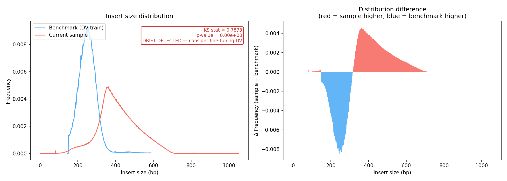
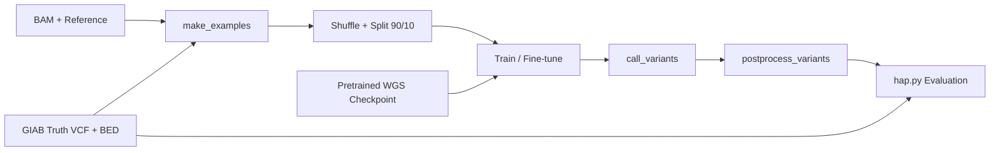

# DeepVariant Fine-Tuning Experiment

**Adapting variant calling models to sequencing data distribution drift**

When library preparation, reagent batches, read-length modes, or mapping strategies change, DeepVariant's variant calling accuracy can silently degrade. This project provides a local Linux CPU fine-tuning pipeline for adapting a pretrained WGS model to internal data. Previously, data could be sent to the Google DeepVariant team for model training, but that path has a long turnaround time and is hard to use for frequent parameter iteration. The current direction is to build local fine-tuning as a parallel/alternative path so LFR_DataMonitor drift signals can trigger repeated, auditable retraining as PE150, SE600, and mixed PE150+SE600 datasets evolve.

---

## Background

**Silent model accuracy degradation**
DeepVariant uses an inception_v3 CNN to call variants (SNV/Indel) from read pileup images. The model is sensitive to distributions of insert size, GC content, base quality, etc. When the input distribution shifts (new library prep batch, reagent update, PE150 → SE600 switch), the model operates out-of-distribution — precision and recall silently degrade with no error signal.

**Fine-tuning advantage**: The pretrained WGS checkpoint (trained on millions of examples) captures general variant-calling features. Fine-tuning adapts these to a target distribution with minimal data (tens of thousands of examples from a single chromosome) and few training steps, far more efficient than training from scratch.

**Key challenges**:
- DeepVariant's CLI flags and training API changed significantly across versions (TF-slim before 1.5, Keras + ml_collections from 1.6+).
- The earlier external-training route relied on sending data to the Google DeepVariant team; it validated the concept, but the turnaround is too long for high-frequency assay and parameter development.
- Company servers do not provide CUDA/NVIDIA GPUs, so the primary implementation targets local Linux CPU fine-tuning first.
- SE600 + PE150 mixed-distribution training needs more internal examples and frequent re-tuning because the data distribution changes during assay, mapping, and parameter development.
- TFRecord GZIP outputs occasionally corrupted, VCF compression format errors, and other container environment issues.

---

## Data Drift Features That Trigger Retraining

This project serves as the retraining backend for [LFR_DataMonitor](https://github.com/YourOrg/LFR_DataMonitor). The following QC metrics map directly to DeepVariant's 7 pileup input channels:

### Drift triggers ranked by importance

**1. insert_size (channel 7) — most critical**

Directly encodes the fragment length (insert size) distribution per read.
Library prep changes (PCR-free vs PCR+, reagent batch, fragment size selection), sequencing mode switches (PE150 → SE600/stLFR), and protocol changes all strongly shift the insert size mean, N50, and CV.
The pretrained WGS model was trained primarily on Illumina PE150 data (insert size ~300-500bp). When this distribution shifts, the pileup image "shape" changes significantly, causing silent accuracy degradation.
Insert size data drift exmaple(output of [LFR_DataMonitor](https://github.com/arcadianlyric/LFR_DataMonitor)):


**2. base_quality (channel 2) — second most important**

Reflects the base quality score (Phred score) distribution.
Affected by sequencing chemistry, reagent aging, instrument calibration, GC bias, and flow cell position effects.
Overall or tail-end shifts in quality distribution directly impact the model's confidence in base calls.

**3. read_base (channel 1) — third most important**

Base composition (A/C/G/T) distribution in the pileup.
GC bias drift (from library prep or sequencer) significantly alters the statistical properties of this channel.
Together with base_quality, commonly used to detect GC content bias and sequence preference changes.

**4. mapping_quality (channel 3) — moderate importance**

Alignment quality (MAPQ) distribution.
Affected by reference genome version, aligner parameters, repeat regions, structural variants, and mapping difficulty changes in new data batches.
An overall MAPQ decrease when new data has more difficult-to-map regions is an important drift signal.

**5. base_differs_from_ref (channel 6) — secondary but useful**

Indicates whether the current position differs from the reference base.
Indirectly reflects mismatch rate drift.
Affected by library prep or sequencing error rate changes, but less direct than the channels above.

**6. strand (channel 4) — lower importance**

Positive/negative strand information.
Generally insensitive to drift, unless severe strand bias occurs (rare).

**7. read_supports_variant (channel 5) — lowest (training label related)**

Primarily used in training mode to mark whether a read supports a candidate variant.
Functions differently during inference (calling); low sensitivity to data drift (more of an internal model learning artifact).

---

## Materials and Methods

### Pipeline Flow



### Project Structure
```
GoogleDeepVariant_FineTuning/
├── notebooks/
│   └── colab_fintune.ipynb       # Cleaned experiment template (WIP)
├── scripts/                       # in-house pipeline, to be released
└── README.md
```

### Input Data

| File | Description | Size |
|------|-------------|------|
| `chr22_test.bam` | HG002 chr22, PE150 (PCR-free WGS) | ~800 MB |
| `GCA_000001405.15_GRCh38_no_alt_analysis_set.fa.gz` | GRCh38 reference genome | 886 MB |
| `truth_chroms_chr22.vcf` | GIAB HG002 truth variants (chr22) | 35 MB |
| `HG002_GRCh38_1_22_v4.2.1_benchmark_noinconsistent.bed` | GIAB confident regions | 11 MB |

### Pipeline Steps

**Step 1: make_examples** — converts BAM + reference into labeled TFRecord pileup images (100×221×7 tensors). Training mode includes truth labels; calling mode does not.
- Tool: `/opt/deepvariant/bin/make_examples` (DV 1.6.1)

**Step 2: Shuffle + Split** — randomize example order, split 90/10 into train/tune datasets. DV 1.6.1 requires both for checkpoint selection.
- Tool: Python `tf.data.TFRecordDataset` (DV 1.6.1 removed the `shuffle_tfrecords` binary)
- Note: `example_info.json` must be copied next to each tfrecord

**Step 3: Train** — fine-tune inception_v3 from pretrained WGS checkpoint.
- Tool: `/opt/deepvariant/bin/train` (NOT `model_train`)
- Config: `ml_collections.ConfigDict` Python file, 25+ required fields
- Checkpoint selection metric: `tune/f1_weighted`

**Step 4: Call Variants** — run the fine-tuned model on the same region for evaluation.
- Tools: `make_examples` (calling mode) → `call_variants` → `postprocess_variants`

**Step 5: Evaluate** — compare output VCF against GIAB truth.
- Tool: `pkrusche/hap.py` (via Docker/udocker)
- Metrics: Precision, Recall, F1 (SNP and INDEL separately)


## Quick Start (Linux CPU Server)

The `scripts/` pipeline is the recommended path for company Linux servers that
do not have NVIDIA CUDA GPUs. It uses Docker CPU execution with
`google/deepvariant:1.6.1` and defaults to a small PE150 chr22 smoke test.
The cloud/Colab notebook remains as historical validation, while local training
is now the main path for high-frequency internal tuning.

1. Put inputs under the project directory:

```text
GoogleDeepVariant_FineTuning/
├── data/
│   └── ch22_E200013531L1.bam
└── ref/
    ├── GCA_000001405.15_GRCh38_no_alt_analysis_set.fa.gz
    ├── truth_chroms_chr22.vcf
    └── HG002_GRCh38_1_22_v4.2.1_benchmark_noinconsistent.bed
```

2. Edit `config/.env` if the project or reference path differs on the server.
   The default training sample is `TRAIN_SAMPLE=pe150`.

3. Run the CPU pipeline:

```bash
cd GoogleDeepVariant_FineTuning
bash scripts/run_pipeline.sh
```

For a smoke test, `config/config.yaml` uses `num_training_steps: 200`. Increase
to `10000-50000` for a real fine-tuning run after the small test succeeds.

For SE600 + PE150 development, start with one stable sample mode (`TRAIN_SAMPLE=pe150`
or `TRAIN_SAMPLE=se600`) and validate the full loop. Mixed training should be
enabled only after enough internal PE150/SE600 examples are available and the
channel configuration is kept consistent across datasets.

## Historical Attempt: Colab / Cloud

The Colab notebook was an early attempt to validate DeepVariant fine-tuning in
the cloud. Separately, sending data to the Google DeepVariant team for training
remains useful as an external reference, but the turnaround is too long for
frequent parameter tuning. It is kept as historical context while local
fine-tuning becomes the operational parallel/alternative path.

1. Prepare data (upload MGI PE150 public data to Google Drive `/dv_finetune/`).

2. Open `notebooks/test.ipynb` (or `colab_fintune.ipynb`) and run all cells sequentially:
- Cell 1–5: Environment setup, data prep, checkpoint download
- Cell 6: make_examples (training)
- Cell 7: Shuffle (with GZIP corruption protection)
- Cell 8: Fine-tune (using `/opt/deepvariant/bin/train`)
- Cell 9–10: Calling + hap.py evaluation

**Note**: The current Colab version runs training on CPU only. For production-scale training, a GCP VM with native Docker + GPU is possible, but local Linux CPU training is preferred for internal high-frequency retraining and data-governance reasons.

### Roadmap

- [ ] **Hybrid PE150 + SE600 training** — joint training with shared channels (drop insert_size) or sequential fine-tuning
- [ ] **Automated drift → retrain pipeline** — connect [LFR_DataMonitor](https://github.com/YourOrg/LFR_DataMonitor) drift detector to trigger fine-tuning via Cloud Functions


### Known Limitations

- **Version compatibility**: Originally developed on DV 1.6.1, later adapted to `latest`. Flags may differ across versions — adjust based on actual errors.
- **GPU support**: Colab + udocker cannot pass GPU to the container; training runs on CPU (slow). For production, use `google/deepvariant:latest-gpu` + `--gpus all`.
- **Data scale**: Current examples use a single chromosome (chr22) for quick validation. Production should use multi-chromosome data with proper train/valid/test splits.
- **GZIP corruption**: `make_examples` output `.tfrecord.gz` occasionally corrupts in container environments; the shuffle step includes a decompress-rewrite workaround.
- **Other common issues**: Missing BAM index, truth VCF not bgzipped, empty file copies, 0 examples generated, etc. See [troubleshooting.txt](troubleshooting.txt).

**Disclaimer**: This project is experimental, for learning and validation purposes only. Conduct thorough testing before production deployment, and refer to the official [DeepVariant GitHub](https://github.com/google/deepvariant) for the latest documentation.

## References

1. [Google DeepVariant](https://github.com/google/deepvariant) — deep learning variant caller
2. [IntelLabs Training Case Study](https://github.com/IntelLabs/open-omics-deepvariant/blob/r1.5/docs/deepvariant-training-case-study.md) — DV fine-tuning reference (older API)
3. [GIAB HG002 Truth Set](https://ftp-trace.ncbi.nlm.nih.gov/ReferenceSamples/giab/) — benchmark variants
4. [hap.py](https://github.com/Illumina/hap.py) — variant calling benchmarking tool
5. [stLFR](https://www.ncbi.nlm.nih.gov/pmc/articles/PMC6499310/) — single tube long fragment read technology
6. [LFR_DataMonitor](https://github.com/YourOrg/LFR_DataMonitor) — upstream QC drift detection pipeline
7. [MGI public data](https://global-mgitech.com/resources/demonstration-data/)
