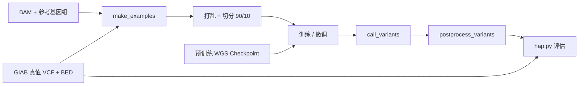

# DeepVariant 微调实验

**应对测序数据分布漂移的模型适配实验**

当测序文库制备、试剂批次、读长模式或比对策略发生变化时，DeepVariant 的变异检测准确率可能出现静默下降。本项目提供一个面向公司 Linux CPU 服务器的本地微调流水线，用于将预训练 WGS 模型适配到内部数据。过去可以将数据发送给 Google DeepVariant team 进行模型训练，但该路径 turnaround 周期较长，不适合频繁参数迭代。当前方向是把本地 fine-tuning 建成并行/替代方案，使 LFR_DataMonitor 的漂移信号能够触发可审计、可重复的再训练，适配 PE150、SE600 以及 PE150+SE600 混合数据在开发过程中的分布变化。

---

## 背景

**模型准确率的静默退化**
DeepVariant 使用 inception_v3 CNN 从 read pileup 图像中检测变异（SNV/Indel）.模型对 insert size、GC 含量、碱基质量等分布敏感.当输入分布发生偏移（新批次文库制备、试剂更新、PE150 → SE600 切换），模型在分布外运行，精确率和召回率静默下降 — 没有报错，只是结果变差。

**微调优势**：利用官方预训练 WGS checkpoint（数百万样本学到的通用特征），仅需少量目标数据（单染色体几万样本）和少量步数即可适配，远比从头训练高效.

**主要挑战**：
- DeepVariant 不同版本的命令行 flag 和训练 API 变化较大（1.6+ 转向 Keras + ml_collections）.
- 早期外部训练路线依赖将数据发送给 Google DeepVariant team；该路线验证了概念，但 turnaround 太长，不适合高频 assay development 和参数调优。
- 公司服务器没有 CUDA/NVIDIA GPU，因此主实现优先采用本地 Linux CPU fine-tuning。
- SE600 + PE150 混合分布训练需要更多内部样本和更频繁 re-tune，因为 assay、mapping 和参数开发都会持续改变数据分布。
- TFRecord GZIP 输出偶尔损坏、VCF 压缩格式错误等容器环境问题.

---

## 触发再训练的数据漂移特征

本项目作为 [LFR_DataMonitor](https://github.com/YourOrg/LFR_DataMonitor) 的再训练后端。以下 QC 指标直接映射到 DeepVariant 的 pileup 输入通道：

### 主要触发条件

1. insert_size （第 7 通道）—— 最重要（通常占主导）

为什么最关键？
它直接编码了每条 read 的 片段长度（insert size / fragment length） 分布。
文库制备变化（PCR-free vs PCR+、不同试剂批次、插入片段选择）、测序模式切换（PE150 → SE600/stLFR）、文库构建协议改变等，都会强烈改变 insert size 的均值、N50、CV（变异系数）。
预训练 WGS 模型主要在 Illumina PE150（insert size ~300-500bp）数据上训练。当分布偏移时，模型看到的 pileup 图像“形状”会明显不同，导致准确率静默下降。
漂移例子(来自[LFR_DataMonitor](https://github.com/arcadianlyric/LFR_DataMonitor))的结果:


2. base_quality （第 2 通道）—— 第二重要

反映碱基质量分数（Phred score）分布。
容易受测序化学、试剂老化、仪器校准、GC 偏差、流道位置效应等影响。
质量分布整体偏移或局部（尤其是尾部）变化，会直接影响模型对碱基可信度的判断。

3. read_base （第 1 通道）—— 第三重要

碱基组成（A/C/G/T）在 pileup 中的分布。
GC bias 漂移（文库制备或测序仪引起）会显著改变这个通道的统计特征。
与 base_quality 一起，常用于检测 GC 含量偏差和序列偏好变化。

4. mapping_quality（第 3 通道）—— 中等重要

比对质量（MAPQ）分布。
受参考基因组版本、比对器参数、重复序列、结构变异、新批次数据 mapping 难度变化等影响。
当新数据有更多难比对区域时，MAPQ 整体降低，是重要漂移信号。

5. base_differs_from_ref（第 6 通道）—— 次要但有用

当前位点与参考碱基是否不同的指示。
间接反映 mismatch rate / 错配率漂移。
文库制备或测序错误率变化时会受影响，但不如前几个直接。

6. strand（第 4 通道）—— 较低重要性

正/负链信息。
一般对漂移不敏感，除非存在严重的 strand bias（少数情况下出现）。

7. read_supports_variant（第 5 通道）—— 最低（训练标签相关）

这个通道主要用于 training 模式 下标记 read 是否支持候选变异。
在 inference（calling）时作用不同，对数据漂移的敏感度较低（更多是模型内部学习的结果）。


---


## 材料与方法

### 流水线流程



### 项目结构
```
GoogleDeepVariant_FineTuning/
├── notebooks/
│   └── colab_finetune.ipynb       # 整理后的实验模板（WIP）
├── scripts/                       # 内部管道,待发布
└── README.md
```


### 输入数据

| 文件 | 说明 | 大小 |
|------|------|------|
| `chr22_test.bam` | HG002 chr22，PE150（[MGI PCR-free WGS](https://global-mgitech.com/resources/demonstration-data/） | ~800 MB |
| `GCA_000001405.15_GRCh38_no_alt_analysis_set.fa.gz` | GRCh38 参考基因组 | 886 MB |
| `truth_chroms_chr22.vcf` | GIAB HG002 真值变异（chr22） | 35 MB |
| `HG002_GRCh38_1_22_v4.2.1_benchmark_noinconsistent.bed` | GIAB 高可信区间 | 11 MB |

### 流水线各步骤

**步骤 1：make_examples** — 将 BAM + 参考基因组转换为带标签的 TFRecord pileup 图像（100×221×7 张量）。训练模式包含真值标签；检测模式不包含。
- 工具：`/opt/deepvariant/bin/make_examples`（DV 1.6.1）

**步骤 2：打乱 + 切分** — 随机打乱样本顺序，90/10 切分为训练/验证集。DV 1.6.1 必须同时提供两者用于 checkpoint 选择。
- 工具：Python `tf.data.TFRecordDataset`（DV 1.6.1 已移除 `shuffle_tfrecords` 二进制）
- 注意：`example_info.json` 必须复制到每个 tfrecord 旁边

**步骤 3：训练** — 从预训练 WGS checkpoint 微调 inception_v3。
- 工具：`/opt/deepvariant/bin/train`（不是 `model_train`）
- 配置：`ml_collections.ConfigDict` Python 文件，25+ 个必填字段
- Checkpoint 选择指标：`tune/f1_weighted`

**步骤 4：变异检测** — 用微调后的模型对同一区域进行变异检测。
- 工具：`make_examples`（calling 模式）→ `call_variants` → `postprocess_variants`

**步骤 5：评估** — 将输出 VCF 与 GIAB 真值进行比较。
- 工具：`pkrusche/hap.py`（通过 Docker/udocker）
- 指标：Precision、Recall、F1（SNP 和 INDEL 分别统计）


## 快速开始（Linux CPU Server）

`scripts/` 流水线是公司 Linux 服务器上的推荐路径，适用于没有 NVIDIA CUDA GPU 的环境。它使用 Docker CPU 执行 `google/deepvariant:1.6.1`，默认是一个小规模 PE150 chr22 smoke test。Colab/cloud notebook 保留为历史验证，本地训练现在是高频内部调参的主路径。

1. 将输入文件放到项目目录：

```text
GoogleDeepVariant_FineTuning/
├── data/
│   └── ch22_E200013531L1.bam
└── ref/
    ├── GCA_000001405.15_GRCh38_no_alt_analysis_set.fa.gz
    ├── truth_chroms_chr22.vcf
    └── HG002_GRCh38_1_22_v4.2.1_benchmark_noinconsistent.bed
```

2. 如果服务器上的项目路径或参考基因组路径不同，修改 `config/.env`。默认训练样本为 `TRAIN_SAMPLE=pe150`。

3. 运行 CPU pipeline：

```bash
cd GoogleDeepVariant_FineTuning
bash scripts/run_pipeline.sh
```

当前 `config/config.yaml` 使用 `num_training_steps: 200` 作为 smoke test。小测试跑通后，再增加到 `10000-50000` 进行真实微调。

对于 SE600 + PE150 开发，建议先固定一种稳定样本模式（`TRAIN_SAMPLE=pe150` 或 `TRAIN_SAMPLE=se600`）跑通完整闭环。只有在内部 PE150/SE600 样本足够、且不同数据集的 channel 配置保持一致后，再开启混合训练。

## 历史尝试：Colab / Cloud

Colab notebook 是早期用于快速验证 DeepVariant fine-tuning 的云端尝试。另外，将数据发送给 Google DeepVariant team 训练仍然可作为外部参考，但 turnaround 周期太长，不适合作为频繁参数调优的主路径。因此该路线保留为历史上下文，本地 fine-tuning 成为当前 operational parallel/alternative path。

1. 准备数据（MGI PE150 公共数据上传到 Google Drive `/dv_finetune/`）：

2. 打开 `notebooks/test.ipynb`（或 `colab_finetune.ipynb`），按顺序运行各 Cell.
- Cell 1–5：环境、数据准备、checkpoint 下载
- Cell 6：make_examples（training）
- Cell 7：shuffle（防 GZIP 损坏版）
- Cell 8：模型微调（使用 `/opt/deepvariant/bin/train`）
- Cell 9–10：calling + hap.py 评估

**注意**：当前 Colab 版本主要使用 CPU 训练。生产规模训练可以使用支持 GPU 的 GCP VM + 原生 Docker，但出于内部高频 retrain 和数据治理考虑，本地 Linux CPU 训练是当前优先路径。

### 路线图

- [ ] **PE150 + SE600 混合训练** — 共享通道联合训练（去掉 insert_size）或序贯微调
- [ ] **自动化漂移 → 再训练流水线** — 连接 [LFR_DataMonitor](https://github.com/YourOrg/LFR_DataMonitor) 漂移检测器，通过 Cloud Functions 触发微调

### 已知限制与注意事项

版本兼容性：本项目最初基于 1.6.1 开发，后续适配了 latest.不同版本的 flag 可能不同，请根据实际报错调整.
GPU 支持：Colab + udocker 通常无法透传 GPU，训练在 CPU 上进行（较慢）。如果使用云端 GPU，可考虑 google/deepvariant:latest-gpu + --gpus all；但公司本地服务器无 CUDA/NVIDIA GPU，因此当前 pipeline 以 CPU 训练为主。
数据规模：当前示例使用单条染色体（chr22 或 chr20）进行快速验证.生产环境建议使用多染色体数据，并进行合理 train/valid/test 切分.
GZIP 损坏问题：make_examples 输出的 .tfrecord.gz 在容器环境中偶尔损坏，已在 shuffle 步骤提供解压重写方案.
其他常见问题：BAM index 缺失、truth VCF 非 bgzip 格式、空文件复制、0 examples 生成等，详见 troubleshooting.md.

免责声明：本项目为实验性质，仅供学习和验证使用.生产环境部署前请进行充分测试，并参考官方 DeepVariant GitHub 最新文档.

## References

1. [Google DeepVariant](https://github.com/google/deepvariant) — deep learning variant caller
2. [IntelLabs Training Case Study](https://github.com/IntelLabs/open-omics-deepvariant/blob/r1.5/docs/deepvariant-training-case-study.md) — DV fine-tuning reference (older API)
3. [GIAB HG002 Truth Set](https://ftp-trace.ncbi.nlm.nih.gov/ReferenceSamples/giab/) — benchmark variants
4. [hap.py](https://github.com/Illumina/hap.py) — variant calling benchmarking tool
5. [stLFR](https://www.ncbi.nlm.nih.gov/pmc/articles/PMC6499310/) — single tube long fragment read technology
6. [LFR_DataMonitor](https://github.com/YourOrg/LFR_DataMonitor) — upstream QC drift detection pipeline
